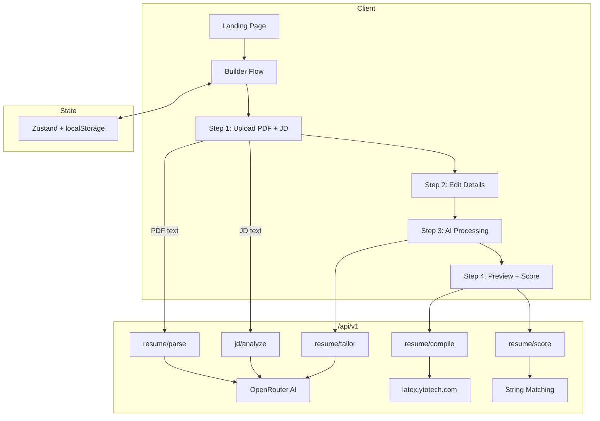

# LumaCV

AI-powered resume builder that brings clarity to your career. Tailors your resume to any job description in seconds.

## Architecture



## Tech Stack

| Layer | Technology |
|-------|-----------|
| Framework | Next.js 14 (App Router) |
| UI | shadcn/ui, Tailwind CSS 4, Framer Motion |
| State | Zustand with `persist` middleware |
| Forms | React Hook Form + Zod |
| AI | OpenRouter (GPT-4o Mini, Llama 3.3, Gemini Flash, Claude 3.5) via Vercel AI SDK |
| PDF Parse | pdfjs-dist (client-side) |
| PDF Render | LaTeX via latex.ytotech.com |
| Theme | next-themes (dark/light) |

## Templates

8 LaTeX templates: Modern, Classic, ATS, Executive, Minimal, Compact, Creative, Tech.

## Recent Updates

- **Creative Template Overhaul**: Compressed the LaTeX list bindings, hardened top/bottom margins, and set intelligent header anchors so long histories fit neatly into a single crisp page without clipping or spilling over.

## Local Setup

```bash
npm install
cp .env.example .env.local  # Set OPENROUTER_API_KEY
npm run dev
```

## Environment Variables

| Variable | Required | Description |
|----------|----------|-------------|
| `OPENROUTER_API_KEY` | Yes | OpenRouter API key for the AI tailoring logic. |
| `OPENROUTER_MODELS` | No | Comma-separated model list for fallback handling. |
| `UPSTASH_REDIS_REST_URL` | No | Upstash Redis connection URL for Rate Limiting. |
| `UPSTASH_REDIS_REST_TOKEN` | No | Upstash Redis REST token. |

## 🚀 Deploying to Vercel (Free Tier)

LumaCV is heavily optimized to run on the **Vercel Hobby (Free)** tier. Since standard LaTeX engines are too large for serverless, PDF compilation is efficiently offloaded to an external REST API (`latex.ytotech.com`).

**Steps:**
1. **Push to GitHub**: Push your working codebase to a new GitHub repository.
2. **Import Project**: Log into [Vercel](https://vercel.com), click **Add New** > **Project**, and select your GitHub repository.
3. **Set Environment Variables**: In the configuration step, open the "Environment Variables" section and add:
   - `OPENROUTER_API_KEY` (required)
   - `UPSTASH_REDIS_REST_URL` & `UPSTASH_REDIS_REST_TOKEN` (optional: highly recommended to prevent API rate-limit abuse on your LLMs).
4. **Deploy**: Click **Deploy**. Vercel will auto-detect Next.js and build it without any extra configuration.

*Vercel features already tuned inside this repo: `maxDuration = 60` for LLM routes, Edge runtime for scorers, and React Server Actions.*

## Built by

[Sahil Bansal](https://sahilbansal.vercel.app/)
